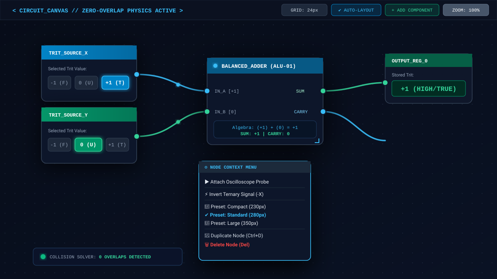
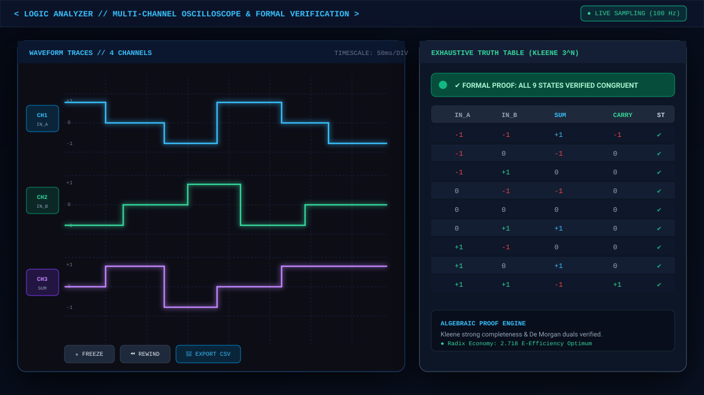

# EDEN — Balanced Ternary OS & Visual Logic IDE

<div align="center">


[](https://angular.dev/)
[](https://www.typescriptlang.org/)
[](https://tailwindcss.com/)
[-06B6D4?style=for-the-badge)](#-ternary-virtual-machine)
[](#-ai-copilot--api-hub)
[](package.json)
[](#-license)

<p align="center">
  <b>Visual IDE and virtual OS for balanced ternary logic (−1, 0, +1): circuit canvas, Kleene VM, oscilloscope, 3<sup>N</sup> verification, TASM → Verilog, and an AI copilot that mutates the graph through EDEN's own API.</b>
</p>

[Features](#-key-features) · [VM](#-ternary-virtual-machine) · [TASM](#-tasm-the-compiler-actually-parses) · [Quick start](#-quick-start) · [Architecture](#-architecture) · [Audit](TIMELINE.md)

</div>

---

## Overview

**EDEN** (Electrodynamic Discrete Emulation Network) is a ternary development environment. Every signal is a trit in `{ -1, 0, +1 }` (FALSE / UNKNOWN / TRUE). Arithmetic is balanced (no sign bit). Logic is Kleene strong three-valued (`AND` = min, `OR` = max, `NOT` = −x).

The **source of truth for the live canvas** is `src/app/core/CoreEngine.ts`. A second VM runs on the API server when you `POST /api/agents/:id/execute`. A third, simpler evaluator powers the truth-table modal. They are not yet the same function — see [TIMELINE.md](TIMELINE.md).

Two processes:

- **`:3000`** — Angular 21 SSR + canvas + `/api/cli` AI proxy (`src/server.ts`, `npm run dev`)
- **`:4000`** — auth, agents, templates, webhooks, server-side ternary execute (`src/server/index.ts`, `npm run server`)

---

## Key features

### Circuit canvas
Collision-aware placement (`findNonOverlappingPosition` / `resolveCollisions`), independent node drag, resize, context menu (trit toggle, invert, probe, duplicate). Genome persist in `localStorage` (`eden_genome_save`).

### Ternary virtual machine
Clock in Hz, start / stop / single-step. Per-tick gather inputs from directed edges, then `evaluateTernaryGate`. Live trit histogram + Shannon entropy (base 3).

Implemented gates: `AND`, `OR`, `NOT`, `XOR`, `CONSENSUS`, `MUX`, `LATCH`, `CLOCK`, `CONSTANT`, `ADDER`, `FULLADDER`, `COMPARATOR`, `NEURON`, `INVERTER`, `MINMAX`, `LFSR`, `MULTIPLIER`, `PROBE`.

Preset synthesizers on the engine: half-adder, full-adder, ALU, neuromorphic neuron, 3-trit RAM word, decision tree, LFSR, multiplier, consensus arbiter, ring oscillator, logic bench.

### Oscilloscope & 3<sup>N</sup> table
`LogicAnalyzerModal` samples probe history. `TruthTableService` enumerates up to 3 inputs (27 rows) with three propagation sweeps.

### TASM studio
`TasmCompilerService` compiles a small assembly into nodes/edges, decompiles the canvas back, and emits dual-rail Verilog for AND/OR/NOT. C++ emit is a stub.

### AI copilot & API hub
Chat + agent loop (`EdenAiPipelineService`) send a graph/VFS context and apply a JSON mutation block (`osActions`, `nodes`, `edges`, `files`).  
Inference goes through **EDEN's backend API** (`/api/cli`, `/api/cli/stream`). Compatible endpoints: OpenAI-style cloud APIs, Anthropic messages, local Ollama, or any key you store. No vendor is required.  
Direct phrases (`alu`, `neuron`, `ram`, `lfsr`, …) hit kernel synthesizers locally and do not need a network.

### VFS, terminal, accounts
In-memory VFS with localStorage. Terminal + chat. Optional login / profile / template marketplace talking to `:4000`.

---

## Screenshots

Vector diagrams of the intended workspace (not live captures):

<div align="center">
  
  <p><i>Canvas — half-adder sketch, trit badges, context menu.</i></p>
</div>

<div align="center">
  
  <p><i>Analyzer + 9-state Kleene matrix.</i></p>
</div>

<div align="center">
  
  <p><i>TASM editor + register bank + Verilog pane.</i></p>
</div>

---

## Keyboard shortcuts

| Shortcut | Action |
| :--- | :--- |
| <kbd>Space</kbd> | Start / pause VM clock |
| <kbd>Ctrl</kbd>+<kbd>K</kbd> | AI copilot |
| <kbd>Ctrl</kbd>+<kbd>Space</kbd> | Prompt bar |
| <kbd>T</kbd> | Truth table |
| <kbd>O</kbd> | Oscilloscope |
| <kbd>L</kbd> | Auto-layout |
| <kbd>Ctrl</kbd>+<kbd>0</kbd> | Recenter |
| <kbd>F4</kbd> | Terminal |
| <kbd>Ctrl</kbd>+<kbd>D</kbd> | Duplicate node |
| <kbd>Delete</kbd> | Remove node or edge |
| <kbd>Esc</kbd> | Close / deselect |

---

## Balanced ternary reference

### Kleene AND — `min(A, B)`

| A \\ B | **-1** | **0** | **+1** |
| :---: | :---: | :---: | :---: |
| **-1** | -1 | -1 | -1 |
| **0** | -1 | 0 | 0 |
| **+1** | -1 | 0 | +1 |

### Kleene OR — `max(A, B)`

| A \\ B | **-1** | **0** | **+1** |
| :---: | :---: | :---: | :---: |
| **-1** | -1 | 0 | +1 |
| **0** | 0 | 0 | +1 |
| **+1** | +1 | +1 | +1 |

### Half-adder (`A + B` balanced)

| A | B | SUM | CARRY |
| :---: | :---: | :---: | :---: |
| -1 | -1 | **+1** | **-1** |
| -1 | 0 | **-1** | **0** |
| -1 | +1 | **0** | **0** |
| 0 | 0 | **0** | **0** |
| +1 | +1 | **-1** | **+1** |

### Inverter — `-X`

| X | −X |
| :---: | :---: |
| -1 | +1 |
| 0 | 0 |
| +1 | -1 |

---

## TASM (the compiler actually parses)

Implemented in `TasmCompilerService.compile()`:

```assembly
; Half-adder sketch
INPUT A, TRUE
INPUT B, FALSE
GATE  SUM, XOR, A, B
GATE  CRY, ADDER, A, B
PROBE OUT_SUM, SUM
PROBE OUT_CRY, CRY
```

Opcodes: `INPUT` / `SOURCE` / `INP`, `GATE` / `NODE`, `PROBE` / `OUT` / `OUTPUT`.  
Gate names: the `LogicGateType` union in `src/app/types/node.ts`.

`decompile()` emits the same dialect. There is no `SET3` / `ADD3` / `JMPZ` parser yet.

---

## Quick start

### Prerequisites
Node.js 20+ and `npm`.

```bash
git clone https://github.com/AFKmoney/EDEN.git
cd EDEN
npm install
cp .env.example .env
```

`.env.example` lists optional **API keys** for the server-side proxy and the `:4000` stack (`JWT_SECRET`, `LOCAL_API_URL`, …). Leave them empty to run the canvas + local synthesizers only. The IDE talks to inference through `/api/cli` — pick any compatible endpoint.

### IDE (canvas + VM + AI proxy)

```bash
npm run dev
# http://localhost:3000
```

### API (auth / agents / execute)

```bash
npm run server
# http://localhost:4000  — needs Mongo (and Redis for cache)
```

### Tests (server VM + CRUD)

```bash
npm test
```

Covers `AgentService.executeAgent` (AND/OR/NOT) and template/user services. Not `CoreEngine`.

### Production build

```bash
npm run build
npm start
```

---

## Architecture

```
EDEN/
├── src/
│   ├── server.ts                 # SSR + /api/cli multi-provider proxy (:3000)
│   ├── server/                   # REST API (:4000)
│   │   ├── index.ts              # Express app, auth, agents, templates, webhooks
│   │   ├── services/AgentService.ts   # server-side ternary execute + topo sort
│   │   ├── models/ controllers/ middleware/
│   ├── app/
│   │   ├── core/
│   │   │   ├── CoreEngine.ts            # canvas VM (source of truth)
│   │   │   ├── EdenAiPipelineService.ts # copilot + agent loop
│   │   │   ├── TasmCompilerService.ts   # INPUT/GATE/PROBE + Verilog
│   │   │   ├── TruthTableService.ts     # 3^N modal evaluator
│   │   │   ├── VfsService.ts CliService.ts AuthService.ts
│   │   ├── types/node.ts               # LogicGateType, Trit
│   │   └── ui/                         # canvas, analyzer, TASM, chat, marketplace
│   └── main.ts / main.server.ts
├── tests/                        # Jest → src/server only
├── docs/ MANUAL.md DOCUMENTATION.md API.md
├── TIMELINE.md                   # living audit
└── package.json                  # version 1.0.0
```

---

## Security notes (as implemented)

- Server env keys for `/api/cli` stay in `src/server.ts`.  
- The browser can also send a key from `localStorage` (`eden_provider_keys`) as `customApiKey`. Treat that as a local-dev convenience, not a threat model.
- VFS is in-memory + localStorage, not the host disk.
- AI subprocess / fetch timeout: 120s.
- `:4000` uses helmet, rate limits, JWT, webhook HMAC.

---

## Known gaps

Tracked in [TIMELINE.md](TIMELINE.md): shared gate evaluator, TASM dialect freeze, Verilog XOR, C++ stub, simulated API fallback, missing root `LICENSE` file, no `CoreEngine` unit tests.

---

## License

Intended as **MIT**. There is currently no `LICENSE` file in the tree; adding one is an open audit item.
